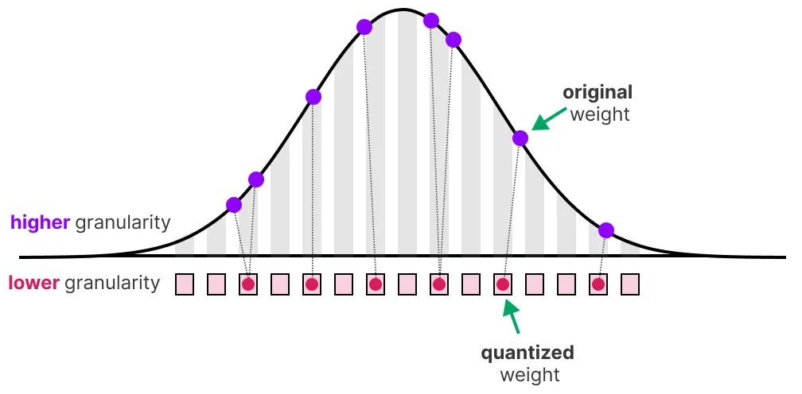
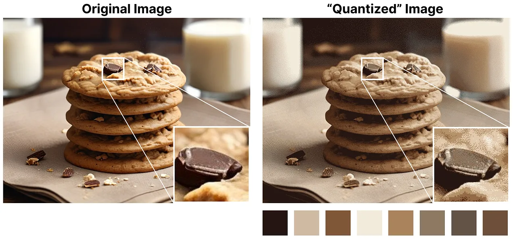
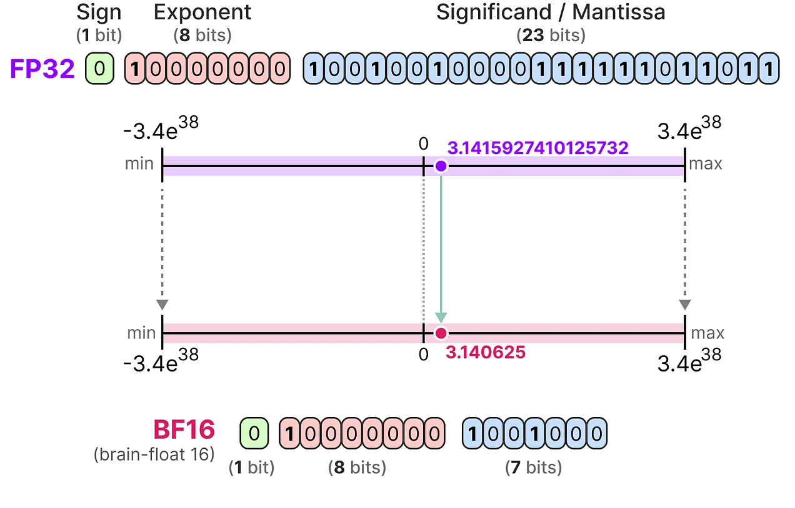
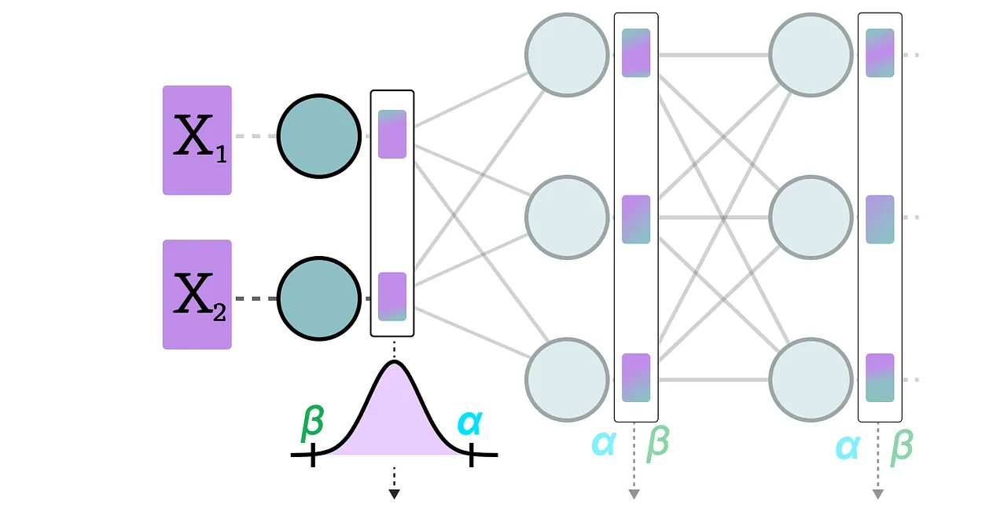

- 원문 링크
    - https://newsletter.maartengrootendorst.com/p/a-visual-guide-to-quantization

# Part 1: The "Problem" with LLMs
LLM이라는 이름은 모델이 갖고 있는 파라미터의 수 때문에 지어졌다. 요즘에 이 모델들은 일반적으로 수십억 개의 파라미터를 갖고 있어 저장 비용이 꽤 비쌀 수 있다.
인퍼런스하는 동안, activation은 가중치와 인풋의 곱으로 생성되며, 따라서 많은 양의 activation 값이 생성된다.

그 결과, 우리는 저장하는데 필요한 공간을 최소화하면서 수십억 개의 값을 가능한 효과적으로 표현하고자 한다. 최적화하기 전에, numerical value들이 어떻게 표현되는지부터 알아보자.

## How to represent numerical values
주어진 값은 floating point number로 표현되는데, 소수점이 있는 양수 또는 음수를 의미한다.
일ㄹ러한 값은 bits 또는 2진수로 표현된다. IEEE-754 표준에서는 bits가 값을 나타내기 위해 사용하는 3가지 함수를 설명한다. : sign, exponent, fraction(or mantissa)

sign, exponent, mantissa를 함께 사용하면 특정 비트 값 집합이 주어진 값을 계산할 수 있다.

값을 나타내는데 사용할 수 있는 비트가 더 많을수록, 일반적으로 더 정확하다.

## Memory Constraints
사용 가능한 비트가 많을수록, 표현할 수 있는 값의 범위가 넓어진다.

표현할 수 있는 값의 인터벌을 dynamic range라고 하며, 인접한 두 값 사이의 거리를 precision이라 한다.

주어진 값을 장치에서 저장할 때 필요한 메모리의 양을 계산할 때, 비트 값을 사용한다. 1바이트의 메모리에 8비트를 저장할 수 있으므로 대부분의 floating point representation에 대한 기본 계산 공식을 만들 수 있다.

*NOTE: 현실에서는, 컨텍스트 사이즈나 아키텍처와 같이 더 많은 것들이 인퍼런스 중 VRAM 사용량과 관련되어 있다.*

이제 700억 파라미터가 있는 모델이 있다고 가정해보자. 대부분의 모델은 기본적으로 float 32bit로 표현되며, 이 경우 모델 로드하는 데에만 280GB 메모리가 필요하다.

따라서, 모델 파라미터를 표현하는 bits 수를 최소화하는 것은 매우 중요하다(트레이닝할 때에도 마찬가지다!). 그러나, precision이 떨어지면 일반적으로 모델 정확도도 떨어진다.

우리는 정확도를 유지하면서 값을 나타내는 bits 수를 줄이고 싶다. 이때, 양자화(quantization)이 쓰이게 된다.

# Part 2: Introduction to Quantizaiton
양자화는 32bit floating point와 같은 높은 bit-wdiths에서 8bit integer와 같이 낮은 bit width로 모델 파라미터의 정밀도를 낮추는 것을 목표로 한다.

원래 파라미터를 나타내는 bits 수를 줄이면 precision이 약간 손실되는 경우가 많다.

이 효과를 설명하기 위해, 어떤 임의의 이미지를 가져와서 8가지 색상만 사용하여 그 이미지를 나타내보도록 하겠다.

확대된 부분이 더 적은 수의 색상을 사용하여 표현하기 때문에 원본보다 더 "거칠게" 보이는 것을 볼 수 있다.

양자화의 메인 목표는 원래 모델 가중치 파라미터의 precision을 최대한 유지하면서 원래 모델 가중치 파라미터를 표현하는데 필요한 bits          수(색상)를 줄이는 것이다.

## Common Data Types
먼저, 일반적인 데이터 타입과 32 bit(called full-precision or FP32) representation 대신 이러한 데이터 유형을 사용할 때 영향에 대해 알아보겠다.

<b>FP16</b>
FP32를 FP16(called half precision)으로 변환할 때 예씨를 보자.

FP16이 가질 수 있는 값의 범위가 FP32보다 상당히 작다는 것을 알 수 있다.

<b>BF16</b>
원래 FP32와 비슷한 범위의 값을 얻기 위해, bfloat16은 "truncated FP32"라는 유형으로 소개되었다.

BF16은 FP16과 동일한 양의 비트를 사용하지만 더 넓은 범위의 값을 취할 수 있으며, 딥러닝 애플리케이션에서 자주 사용된다.

<b>INT8</b>
비트 수를 더 줄이면 floating-point representation보다는 integer-based representation 영역으로 접근하게 된다. 예를 들어, FP32를 INT8로 바꾸면 원래 비트 수의 1/4가 된다.

비트가 줄어들 때마다 매핑을 수행하여 처음 FP32 값을 더 낮은 비트로 압축("squeeze")한다.

실제로는 FP32 값이 가질 수 있는 값의 전체 범위[-3.4e38~ 3.4e38]을 INT8로 매핑할 필요는 없다. 우리는 모델 파라미터가 갖는 값의 범위만큼만 INT8로 매핑할 수 있는 방법을 찾으면 된다.

일반적인 squeeze/mapping method로는 symmetric, asymmetric quantization을 사용하며 이것은 linear mapping의 일종이다.

FP32에서 INT8로 양자화하는 방법들을 알아보겠다.

## Symmetric Quantization
대칭 양자화에서는 original floating point 값의 범위가 0을 중심으로 하는 양자화된 symmetric range space로 매핑된다.
이전 예제에서는 양자화 전후의 범위가 0을 중심으로 유지되는 것을 볼 수 있다.

이것이 의미하는 것은 floating point space에서 값이 0인 경우, 양자화된 공간에서 값도 0이 된다는 것이다.

symmetric quantization 형태의 좋은 예제는 absolute maximum(absmax) quantization이라고 한다.
주어진 리스트에서 가장 큰 절댓값을 갖는 value (α)를 linear mapping을 수행할 범위로 설정한다.

*[-127, 127] 범위는 제한된 범위를 나타낸다. unrestricted range는 [-128, 127]이며 이것은 양자화 방법에 따라 의존된다.*

0을 중심으로하는 linear mapping이기 때문에, Formula는 간단하다.

우리는 먼저 scale factor (s)를 계산할 것이다.
- b는 우리가 quantize하려는 byte 수를 의미한다.(이 경우 8)
- α는 가장 큰 절대값을 의미한다.
그리고, 우리는 input x를 scale factor s를 사용하여 양자화할 것이다.

값을 채우면 다음과 같은 결과가 나온다.

원래 FP32 value를 계산하고 싶으면, 우리는 이전에 사용한 scale factor를 사용하여 양자화된 값을 역양자화할 수 있다.

양자화를 적용하고 이후 역양자화를 진행하면 원래 값은 다음과 같이 보인다.

3.08, 3.02처럼 특정 값이 36(INT8)로 할당된 것을 볼 수 있다. 이 값을 역양자화하여 FP32로 변환하면 precision이 떨어지고, 더이상 값을 구분할 수 없게 된다.

이것을 흔히 양자화 오차(quantization error)라고 하며 원래 값과 양자화된 값의 차이를 구하여 계산할 수 있다.

일반적으로, 낮은 비트수를 사용하면 양자화 오류가 커지는 경향이 있다.

## Asymmetric Quantization
Asymmetric quantization은 반대로 0을 중심으로 대칭이 아니다. 대신, 실수 범위의 최소값(β)과 최대값(α)을 양자화된 범위의 최소값과 최대값에 매핑한다.

우리가 알아볼 방법은 영점 양자화(zero-point quantization)이다.

0의 위치가 어떻게 시프팅되었는지 보이는가? 이것이 왜 asymmetric quantization이라 불리는 이유이다. 최소/최대 값은 [-7.59, 10.8]범위에서 0까지의 거리가 서로 다르다.

시프팅된 위치 때문에, 우리는 linear mapping을 수행하기 위해서 INT8 범위의 영점을 계산해야한다. 이전과 마찬가지로, scale factor를 계산해야하는데 이때 INT8의 범위([-128, 127])를 사용하여 계산한다.

가중치를 시프팅하기 위해 INT8 범위의 영점(z)를 계산해야 하여 조금 복잡해진다.

이전과 마찬가지로 공식에 값을 채워보겠다.

INT8에서 FP32로 역양자화를 하려면, 우리는 이전에 계산한 scale factor와 zeropoint를 사용해야한다.

그 외에, 역양자화는 간단하다.

symmetric quantization과 asymmetric quantization을 같이 두면 두 방법의 차이를 금방 알 수 있다.

symmetric quantization의 zero-centered 특성과 asymmetric quantization의 offset에 주목해라.

## Range Mapping and Clipping
이전 예제에서는 주어진 벡터의 값 범위를 lower-bit representation으로 매핑하는 방법에 대해 알아보았다.
이 방법은 벡터의 모든 값의 범위를 매핑할 수 있지만, 큰 단점이 있는데 바로 outlier이다.
다음과 같은 값을 가진 벡터가 있다고 상상해보자.

값 1개가 다른 값들에 비해 매우 커서 outlier로 여겨질 수 있다. 이 벡터의 전체 range를 매핑하게 된다면 모든 작은 값들은 같은 lower-bit representation으로 매핑되어 그 값들을 구분할 수 있는 방법이 없어진다.

대신에, 우리는 특정 값을 클리핑(clipping)하도록 선택할 수 있다. 클리핑은 모든 outlier가 동일한 값을 갖도록 원래 값의 dynamic range를 다르게 설정하는 것을 포함한다.

아래 예제에서, dynamic range를 [-5, 5]로 매뉴얼하게 설정한다면 그 밖의 모든 값은 값에 관계없이 -127 또는 127로 매핑된다.

가장 큰 장점은 non-outlier의 양자화 오차가 크게 줄어든다는 점이다. 하지만 outlier의 양자화 오차는 증가한다.

## Calibration
이 예제에서는 [-5, 5]의 임의의 범위를 선택하는 naive한 방법을 보여줬다. 이 범위를 선택하는 과정을 calibration이라고 하며, calibration은 양자화 오류를 최소화하면서 가능한 많은 값을 포함하는 범위를 찾는 것을 목표로 한다.

calibration을 수행하는 단계는 모든 종류의 파라미터에 대해 동일하지 않다.

### Weights(and Biases)
LLM의 weight와 bias는 모델을 실행하기 전에 알 수 있으므로 static value라고 볼 수 있다. 예를 들어, Llama3의 ~20GB 파일은 대부분 weight와 bias로 구성되어 있다.

수십억개의 weights(billions)보다 수백만 개(millions)의 bias가 훨씬 적기 때문에, bias는 종종 더 높은 정밀도(e.g. INT16)로 유지되며, quantization은 주로 weights에 집중한다.

정적으로 알려진 weight의 경우, range를 선택하는 calibration 기술에는 다음이 포함된다.
- 입력 데이터의 percentile을 수동으로 선택하기
- 원래 가중치와 양자화된 가중치 사이의 오차(MSE)를 최적화하기
- 원래 값과 양자화된 값 사이의 KL divergence 값을 최소화하기

예를 들어, percentile을 선택하면 앞에서 본 것처럼 clipping을 사용한다.

### Activations
LLM 전반에 걸쳐 지속적으로 업데이트되는 입력 값은 일반적으로 activations라 한다.

weights와 달리 activations는 모델 인퍼런스 중에 모델에 입력되는 각 입력 데이터에 따라 달라지므로 정확하게 quantize하는 것이 어렵다.

이러한 값들은 각 hidden layer 후에 업데이트되기 때문에, 입력 데이터가 모델을 통과하여 인퍼런스될 때에만 알 수 있다.

넓게 보면,  weights와 activation의 quantization을 calibration하는 방법은 크게 2가지가 있다.
- Post-Training Quantization(PTQ)
    - 트레이닝 이후에 quantization
- Quantization Aware Training(QAT)
    - 트레이닝이나 파인 튜닝 중에 quantization

# Part 3: Post-Training Quantization(PTQ)
가장 인기있는 quantization 방법 중 하나는 PTQ이다. 모델을 학습시킨 후 모델의 파라미터(weight, activation 모두)를 quantization하는 것을 의미한다.

weight quantization은 symmetric/assymetric quantization을 사용하여 수행된다.

하지만 activation quantization은 그 범위를 알 수 없으므로 모델을 추론하여 그 값의 잠재적인 분포를 구해야한다.

activaiton의 quantization은 2가지 형태가 있다.
- Dynamic Quantization
- Static Quantization

## Dynamic Quantization
데이터가 hidden layer를 통과하면 해당 activation 값이 수집된다.

activations 값의 분포는 output을 quantize하는데 필요한 zero point, scale factor를 계산하는데 사용된다.

이 과정은 데이터가 새로운 레이어를 통과할 때마다 반복된다. 따라서 각 레이어마다 별도의 zero point, scale factor 값을 가지며 양자화 방식도 다르다.

## Static Quantization
동적 양자화와 달리 정적 양자화는 inference 쩐에 미리 zero point, scale factor를 계산한다.

이러한 값을 찾기 위해 calibration dataset을 사용하고 모델에게 제공해서 추론 값의 잠재 분포를 수집하도록 한다.

이러한 값을 수집한 후에는 우리는 inference 중에 quantization을 수행하는데 필요한 scale factor와 zero point 값을 계산할 수 있다.

실제로 inference할 때, s와 z는 다시 계산되지 않고 모든 activation에 대해 글로벌하게 사용되어 quantize하는데 쓰인다.

일반적으로, 동적 양자화는 hidden layer당 scale factor, zero point를 계산하기 때문에 조금 더 정확한 경향이 있으나 이 값들을 계산해야 해서 인퍼런스 시간이 조금 더 느려질 수 있다.

반대로 정적 양자화는 정확도는 떨어지지만 quantization에 쓰일 scale factor와 zero point를 미리 알기 때문에 인퍼런스 시간이 더 빠르다.

## The Realm of 4-bit Quantization
비트가 손실될 때마다 양자화 오류가 커지기 때문에 8bit 양자화보다 더 적게 비트수를 사용하는 것은 어려운 작업임이 입증되었다. 다행히도 6, 4, 2bits를 사용하는 스마트한 방법들도 몇 가지 있다.
허깅페이스에서 일반적으로 공유되는 2가지 방법에 대해 알아보겠다.
- GPTQ(GPU에 full model 로딩)
- GGUF(CPU로 레이어를 오프로딩하는 법)

### GPTQ
GPTQ는 4비트로 양자화하기 위해 사용되는 가장 잘 알려진 방법 중 하나다.

이 방법은 asymmetric quantization을 사용하며 각 레이어가 다음 레이어로 넘어가기 전에 독립적으로 처리되도록 레이어별로 양자화를 수행한다.

layer-wise quantization 프로세스에서는 먼저 레이어의 가중치를 inverse-Hessian으로 변환한다. 이것은 모델의 loss function의 2차 미분값이며 모델의 출력이 각 weight의 변화에 얼마나 민감한지 알려준다.

단순화하면, 레이어에서 각 weight의 중요성을 나타내는 것이다.

Hessian matrix에서 작은 값과 연관된 weight가 더 중요한 이유는 이러한 weight의 작은 변화가 모델 성능에 큰 변화를 가져올 수 있기 때문이다.

다음으로, 우리는 weight matrix의 첫 번째 row의 weight를 양자화한 후 역양자화한다.

이 과정을 통해 미리 계산한 inverse-Hessian을 사용하여 quantization error를 계산하게 된다.

기본적으로, 가중치의 중요도를 기반으로 weighted quantization error를 계산한다.

다음으로, weighted quantization error를 행의 다른 weight로 재분배한다. 이렇게 하면 네트워크의 전체 함수와 output을 유지할 수 있다.

예를 들어 두번째 weight, 즉 x2에 대해 이 작업을 수행하려면 quantization error에 두번째 weight의 inverse-hessian을 곱한 값을 더한다.

같은 프로세스를 주어진 row의 3번째 weight에도 적용한다.

모든 값이 양자화될 때까지 weighted quantization error를 재분배하는 과정을 반복한다.

weight는 일반적으로 서로 연관되어 있기 때문에 이 과정이 매우 잘 작동한다. 따라서 하나의 weight에 quantization error가 생기면 다른 관련 weight도 inverse-Hessian을 통해 업데이트된다.

NOTE: 저자들은 Hessian에 dampening factor 추가, lazy batching, Cholesky method를 사용한 pre-computing information 등을 사용하여 computation speed를 올리고 성능을 개선하였다. 자세한 것은 유튜브 영상을 참조해라.
TIP: 성능 최적화 및 인퍼런스 속도 최적화를 목표로 하는 quantization 방법을 원한다면 EXL2를 확인해봐라.

### GGUF
GPTQ는 GPU에 모델을 다 올릴 수 있을 때 좋은 quantization method이지만, 항상 그 VRAM을 가질 수 있는 것은 아니다. GGUF를 사용해서 LLM의 모든 레이어를 CPU로 오프로딩할 수 있다.

이렇게 하면 VRAM이 충분하지 않을 때 CPU, GPU 모두 사용할 수 있다.

GGUF는 자주 업데이트되며 bit quantization의 수준에 따라 달라질 수 있다. 하지만 일반적인 원칙은 다음과 같다.

먼저 주어진 레이어의 weight를 각각 sub block 세트를 포함하는 super block으로 나눈다. 이 블록에서 scale factor와 alpha를 추출한다.

주어진 sub block을 양자화하려면 앞서 사용한 absmax quantization을 사용할 수 있다. 주어진 weight에 scale factor를 곱해야한다.

scale factor는 sub block의 정보를 사용하여 계산되지만 자체 scale factor를 가진 super block의 정보를 사용하여 quantization 된다.

block-wise quantization은 super block의 scale factor를 사용하여 sub block의 scale factor를 양자화한다.

각 quantization level의 각 scale factor는 다를 수 있으며 일반적으로 super block이 sub block의 scale factor보다 더 높은 precision을 가진다.

설명을 위해 몇가지 종류의 다른 레벨의 quantization을 보겠다.

모든 quantizaiton level에 따른 개요는 [PR](https://github.com/ggerganov/llama.cpp/pull/1684)을 확인해라.

# Part 4: Quantization-Aware Training(QAT)
파트 3에서는 트레이닝 이후에 모델을 어떻게 양자화할지에 대해 알아봤다. 이 방법의 단점은 실제 트레이닝 과정을 고려하지 않는다는 점이다.

QAT는 트레이닝 중에 quantization을 학습하는 것을 목표로 한다.

QAT는 트레이닝 중에 이미 quantization이 고려되었기 때문에 PTQ보다 더 정확한 경향이 있다. QAT는 다음과 같이 작동한다.

트레이닝 중에, "fake" quants가 사용된다. 예를 들어 weight를 INT4로 먼저 qunatization한 다음, 다시 FP32로 역양자화하는 과정이다.

이 프로세스를 통해 모델은 트레이닝, loss 계산, weight update 중에 quantization process를 고려할 수 있다.

narrow minima는 더 큰 양자화 오류를 초래하는 경향이 있으므로 QAT는 wide minima에 대한 loss landscape를 탐색하여 양자화 오류를 최소화하려고 시도한다.

예를 들어, backward pass에서 quantization을 고려하지 않았다고 가정해보자. gradient descent에 따라 loss가 가장 작은 weight를 선택한다. 하지만 narrow minima인 경우, 양자화 오차가 더 커진다.

반대로 quantiation을 고려하면 wide minima에서 훨씬 낮은 양자화 오차를 가진 다른 가중치가 선택된다.

따라서, PTQ는 high precision(FP32)에서는 loss가 적지만, QAT는 우리가 목표로 하는 low precision(e.g. INT4)에서 loss가 더 적다.

## The Era of 1-bit LLMs: BitNet
4비트보다 더 줄이면 어떻게 될까?

바로 이 부분에서 주어진 가중치에 대해 -1 또는 1을 사용하여 모델 단일 1비트 weight를 나타내는 BitNet이 등장한다.

이 모델은 양자화 프로세스를 트랜스포머 아키텍처에 직접 주입하여 이것을 수행한다.

트랜스포머 아키텍처는 대부분 LLM의 기초로 사용되어 linear layer를 포함하는 계산으로 구성되어 있다.

이러한 linear layer는 일반적으로 FP16과 같이 high precision으로 표현되며, 대부분의 weight가 있는 곳이다.

BitNet은 이러한 linear layer를 BitLinear로 대체한다.

BitLinear layer는 일반적인 linear layer와 동일하게 작동하며 weight에 activation을 곱한 값을 output으로 계산한다.
대조적으로, BitLinear layer는 1비트를 사용하여 모델의 가중치를 나타내고, INT8을 사용하여 activation을 나타낸다.

QAT와 같은 BitLinear layer는 트레이닝 중에 일종의 가짜 양자화를 수행하여 weight, activation의 양자화 효과를 분석한다.

BitLinear를 단계별로 알아보겠다.

### Weight Quantizaton
모델 트레이닝하는 동안, weight는 INT8에 저장된 다음 signum 함수라 불리는 기본 전략을 사용하여 1비트로 양자화된다.

본질적으로 가중치 분포를 0을 중심으로 이동시킨 다음, 왼쪽은 -1, 오른쪽은 1로 할당한다.

추가적으로 나중에 역양자화할 때 사용할 값 beta(평균 절대값)을 추적한다.

### Activation Quantizaton
activations를 양자화하려면 matrix multiplication을 위해 더 높은 precision이 필요하므로 BitLinear는 absmax quantization을 사용하여 activation을 fp16 -> INT8로 변환한다.

추가적으로, alpha (가장 큰 절대값)를 나중에 역양자화할 때 쓰기 위해 추적한다.

### Dequantization
alpha, beta는 activation을 FP16으로 다시 역양자화할 때 쓰인다.

output activation은 alpha, gamma로 재조정되어 원래 precision으로 다시 역양자화된다.

그게 끝이다. 이 방법은 비교적 간단하며 모델을 -1 또는 1 두 가지 방법으로만 표현할 수 있다.

이 절차를 사용하여 저자들은 모델 크기가 커질수록 1비트 트레이닝과 FP16 트레이닝 간의 성능 격차가 줄어드는 것을 확인했다.

하지만 이것은 모델의 파라미터 개수가 30B 이상일 때에만 해당되며, 작은 모델에서는 여전히 갭이 크다.

## All Large Language Models are in 1.58 Bits
앞서 언급한 scaling issue 때문에 BitNet 1.58b가 소개되었다.

새로운 방식에서는 -1, 0, 1 이렇게 3개의 값을 사용한다. 흥미롭게도 0만 추가하면 BitNet이 크게 개선되며 더 빠른 계산이 가능해진다.

### The Power of 0
0을 추가하면 왜 계산 속도가 크게 향상될까? 이것은 matrix multiplication과 관련이 있다.
먼저, matrix multiplication이 어떻게 작동하는지 살펴보자.
output을 계산할 때, weight matrix에 input vector를 곱한다. 아래는 weight matrix의 첫 번째 레이어에 대한 첫 번째 곱셈을 시각화한 것이다.

이 곱셈에는 individual weights에 input을 곱한 다음 모두 합산하는 두 가지 작업이 포함된다.

반면, BitNet 1.58b는 삼항 가중치가 기본적으로 다음을 알려주기 때문에 곱셈 작업을 생략할 수 있다.
- 1: 이 값을 더하고 싶다
- 0: 이 값을 원하지 않는다
- -1: 이 값을 빼고 싶다

따라서 모델 가중치가 1.58bit로 quantize된 경우, 더하기(addition)만 계산하면 된다.

계산 속도가 크게 증가하는 것뿐만 아니라, feature filtering도 가능하다.

weight를 0으로 설정하면 이제 1-bit representation 때와는 달리 무시하는 것이 가능하다.
1-bit representation에서는 가중치를 더하거나 뺐어야했다.

### Quantization
BitNet 1.58b는 weight quantization을 위해 앞서 살펴본 것처럼 absmax quantization의 변형인 absmean quantization을 사용한다.

이것은 단순히 weights distribution을 압축하고, absolute mean을 사용해서 값을 양자화한다. 그리고 -1, 0, 1로 반올림한다.

BitNet과 비교했을 때, activation quantization은 1가지를 제외하고 동일하다. Activation scaling을 [0, 2^b-1]로 하는 대신 [-2^b -1, 2^b -1]로 스케일링하고 absmax quantization을 사용한다.
1.58bit quantization에는 2가지 트릭이 필요하다.
- 0을 추가하여 삼항 표현(ternary representation)
- 가중치에 대한 absmean quantization

<b>"13B BitNet b1.58 is more efficient, in terms of latency, memory usage, and energy consumption than a 3B FP16 LLM”</b>

